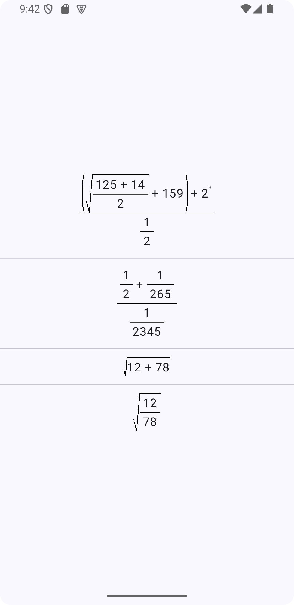

# Math Expression Renderer for Jetpack Compose

A Jetpack Compose library for dynamically rendering mathematical expressions, including support for fractions, roots, powers, and basic arithmetic operations.

## Features

- Display complex math expressions using Jetpack Compose.
- Supports fractions, square roots, exponents, and basic math operators.
- Customizable and reusable components to create rich, interactive UIs with mathematical expressions.

## Usage

Below is an example of how to use this library to create a set of mathematical expressions:

```
@Preview(showBackground = true)
@Composable
private fun App(modifier: Modifier = Modifier) {
    Column(
        modifier = modifier.fillMaxSize(),
        horizontalAlignment = Alignment.CenterHorizontally,
        verticalArrangement = Arrangement.Center
    ) {
        Fraction(
            numerator = {
                Plus(
                    left = {
                        Parenthesis(
                            content = {
                                Plus(
                                    left = {
                                        SquareRoot(
                                            content = {
                                                Fraction(
                                                    numerator = {
                                                        Plus(left = "125", right = "14")
                                                    },
                                                    denominator = "2"
                                                )
                                            }
                                        )
                                    },
                                    right = "159"
                                )
                            }
                        )
                    },
                    right = {
                        Power(base = "2", exponent = "3")
                    }
                )
            },
            denominator = {
                Fraction(numerator = "1", denominator = "2")
            }
        )

        Spacer(modifier = Modifier.height(10.dp))
        HorizontalDivider()
        Spacer(modifier = Modifier.height(10.dp))

        Fraction(
            numerator = {
                Plus(
                    left = {
                        Fraction(numerator = "1", denominator = "2")
                    },
                    right = {
                        Fraction(numerator = "1", denominator = "265")
                    }
                )
            },
            denominator = {
                Fraction(numerator = "1", denominator = "2345")
            }
        )

        Spacer(modifier = Modifier.height(10.dp))
        HorizontalDivider()
        Spacer(modifier = Modifier.height(10.dp))

        SquareRoot(
            content = {
                Plus(left = "12", right = "78")
            }
        )

        Spacer(modifier = Modifier.height(10.dp))
        HorizontalDivider()
        Spacer(modifier = Modifier.height(10.dp))

        SquareRoot(
            content = {
                Fraction(numerator = "12", denominator = "78")
            }
        )
    }
}
```

## Demo




## Components

Fraction: Displays a fraction with customizable numerator and denominator.

Plus: Represents addition between two expressions.

Minus: Represents subtraction between two expressions.

Times: Represents multiplication between two expressions.

Parenthesis: Wraps content in parentheses for grouped expressions.

SquareRoot: Renders the square root of an expression.

Power: Displays exponentiation (e.g., base raised to exponent).

